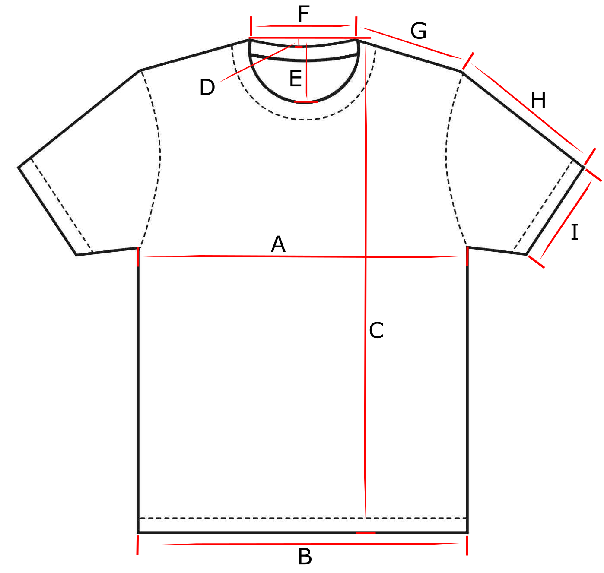

# Teeindex - t-shirt quality index

Which t-shirt has the best quality based on shrinkage, shape and color after use and washing?

This index can also be used to find the perfect size by measuring your current favorite t-shirt and comparing it to the table below.

## How to measure

Place the t-shirt on a flat surface.
Make sure the t-shirt is stretched in all directions and has no creases or wrinkles.
Measure with a tape measure.

## How to wash

Follow the manufacturer's recommendation.
Do not tumble dry. This will affect the t-shirt the most and make comparisons to other non-tumble dried t-shirts difficult.

## T-shirt list

In alphabetical order by brand.

- Numbers are in metric system.
- Price is list price in dollars, without discounts.
- Weight is in gram/m2.
- MFG: Manufactured in.
- Wash rec: Washing recommendations from the manufacturer.
- Wash act: Actual washing temperature.
- Tagless: Is the care tag/label printed in the t-shirt: No, Yes, Partly.
- Measurements:
  - A-G: New t-shirt. Measure before wearing.
  - A 1-G 1: Washed once. Measure before wearing after first wash.
  - A 5-G 5: Washed five times. Measure before wearing after fifth wash.
- Form is a number that describes the amount of twist, skew or length asymmetry of the t-shirt. Valid numbers are: 0: none, 1: small, 2: big. If one part of the body or sleeve shrinks relative to the other part, it's counted as a length asymmetry.
  - Body and Sleeve is noted when the t-shirt is brand new.
  - Body 1 and Sleeve 1 is noted when the t-shirt has been washed once.
  - Body 5 and Sleeve 5 is noted when the t-shirt has been washed five times.

### T-shirts

| Brand and name                | Size | Art. no.  | Fabric                  | Weight | MFG        | Wash rec. | Wash act. | Price | Color | Tagless | Notes |
| ----------------------------- | ---- | --------- | ----------------------- | ------ | ---------- | --------- | --------- | ----- | ----- | ------- | ----- |
| Blåkläder Workwear            | L    | 3300-1030 | 100% cotton             | 180    | Bangladesh | 60        | 40        | $17   | Black | No      | -     |
| Swetees Heritage tailored fit | L    | Version 1 | 95% cotton, 5% elastane | 210    | Turkey     | 30        | 40        | $29   | Black | Yes     | -     |

### Measurements

| Brand and name                | A    | B   | C   | D   | E    | F   | G   | A 1 | B 1  | C 1 | D 1  | E 1  | F 1 | G 1  | A 5 | B 5 | C 5 | D 5 | E 5 | F 5 | G 5 | Notes |
| ----------------------------- | ---- | --- | --- | --- | ---- | --- | --- | --- | ---- | --- | ---- | ---- | --- | ---- | --- | --- | --- | --- | --- | --- | --- | ----- |
| Blåkläder Workwear            | 55.5 | 55  | 75  | 16  | 17   | 22  | 19  | 53  | 52.5 | 74  | 14.5 | 17.5 | 21  | 18   | -   | -   | -   | -   | -   | -   | -   | -     |
| Swetees Heritage tailored fit | 57   | 55  | 74  | 18  | 14.5 | 23  | 19  | 57  | 56   | 73  | 17.5 | 14.5 | 22  | 18.5 | -   | -   | -   | -   | -   | -   | -   | -     |

### Form

| Brand and name                | Body | Body 1 | Body 5 | Sleeve | Sleeve 1 | Sleeve 5 | Notes |
| ----------------------------- | ---- | ------ | ------ | ------ | -------- | -------- | ----- |
| Blåkläder Workwear            | 0    | 0      | -      | 0      | 0        | -        | -     |
| Swetees Heritage tailored fit | 0    | 0      | -      | 0      | 1        | -        | -     |

## Score

The following criteria give minus points (from highest minus point to lowest):

- T-shirt is twisted.
- Measurements vary between washes.
- Recommended washing temperature under 40°C.

If two shirts have the same score, the cheaper one is a better buy.

A list with scores are coming.

## Contribute

Let's make this list bigger! Make a PR and add your t-shirt to the list.
