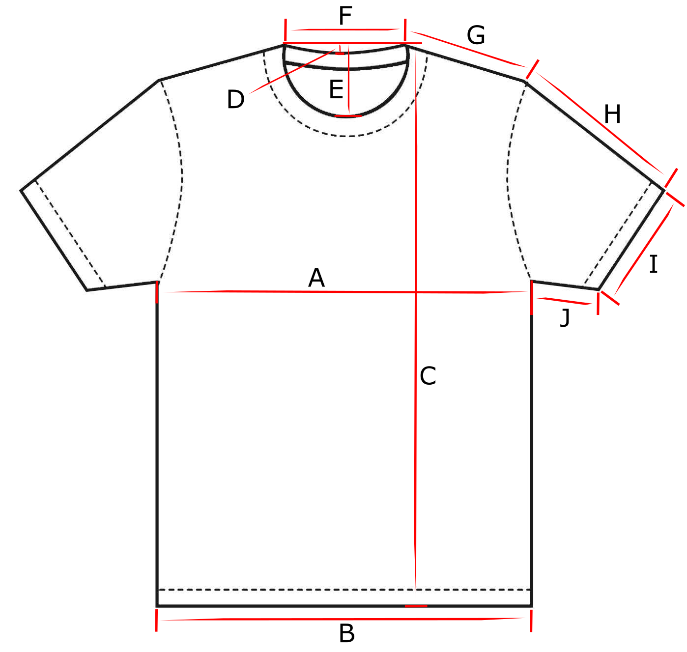

# Teeindex - t-shirt quality index

Which t-shirt has the best quality based on shrinkage, shape and color after use and washing?

This index can also be used to find the perfect size by measuring your current favorite t-shirt and comparing it to the table below.

## How to measure

Place the t-shirt on a flat surface.
Make sure the t-shirt is stretched in all directions and has no creases or wrinkles.
Sometimes it can be easier to measure the t-shirt when it is turned inside out.
Measure with a tape measure.

## How to wash

Follow the manufacturer's recommendation.
Do not tumble dry. This will affect the t-shirt the most and make comparisons to other non-tumble dried t-shirts difficult.

## T-shirt list

In alphabetical order by brand.

- Numbers are in metric system.
- Price is list price in dollars, without discounts.
- Weight is fabric in gram/m2.
- MFG: Manufactured in.
- Wash rec: Washing recommendations from the manufacturer.
- Wash act: Actual washing temperature.
- Tagless: Is the care tag/label printed in the t-shirt: No, Yes, Partly.
- Measurements:
  - A-G: New t-shirt. Measure before wearing.
  - A 1-G 1: Washed once. Measure before wearing after first wash.
  - A 5-G 5: Washed five times. Measure before wearing after fifth wash.
- Shape and color sets a number that describes the amount of twist, skew or length asymmetry in the t-shirt, as well as the amount of color variation between washes. If the t-shirt is longer in the front or in the back, make a note. Valid numbers are 0: none, 1: small, 2: large. If one part of the body or sleeve shrinks relative to the other, it's counted as length asymmetry.
  - Body, neck and sleeve is noted when the t-shirt is brand new.
  - Body 1, neck 1, sleeve 1 and color 1 is noted when the t-shirt has been washed once.
  - Body 5, neck 5, sleeve 5 and color 5 is noted when the t-shirt has been washed five times.

### T-shirts

| Brand and name                | Size | Art. no.   | Fabric                    | Weight | MFG        | Wash rec. | Wash act. | Price | Color | Tagless | Notes                                          |
| ----------------------------- | ---- | ---------- | ------------------------- | ------ | ---------- | --------- | --------- | ----- | ----- | ------- | ---------------------------------------------- |
| Blåkläder Workwear            | L    | 3300-1030  | 100% cotton               | 180    | Bangladesh | 60        | 40        | $17   | Black | No      | -                                              |
| Fristads Acode 1911           | L    | 100239-940 | 100% cotton               | 150    | Bangladesh | 60        | 40        | $15   | Black | No      | No seams in body.                              |
| ID Identity Interlock         | L    | 0517       | 100% cotton               | 215    | Bangladesh | 40        | 40        | $21   | Black | No      | -                                              |
| ID Identity PRO Wear          | L    | 0300       | 60% cotton, 40% polyester | 215    | Bangladesh | 60        | 40        | $19   | Black | No      | -                                              |
| Stanley/Stella Rocker         | L    | STTU758    | 100% cotton               | 150    | Bangladesh | 30        | 40        | $8    | Black | No      | -                                              |
| Swetees Heritage Tailored Fit | L    | Version 1  | 95% cotton, 5% elastane   | 210    | Turkey     | 30        | 40        | $29   | Black | Yes     | -                                              |
| Uniqlo Crew Neck Short Sleeve | L    | 341-465186 | 100% cotton               | -      | Cambodia   | 40        | 40        | $20   | Black | No      | A bit stiff fabric, called heavyweight cotton. |

### Measurements

#### New

| Brand and name                | A    | B    | C    | D   | E    | F    | G    | H    | I    | J    | Notes |
| ----------------------------- | ---- | ---- | ---- | --- | ---- | ---- | ---- | ---- | ---- | ---- | ----- |
| Blåkläder Workwear            | 55.5 | 55   | 75   | -   | -    | 16   | 17   | 22   | 19   | -    | -     |
| Fristads Acode 1911           | 56.5 | 57   | 76   | -   | -    | 14.5 | 18   | 21   | 21   | -    | -     |
| ID Identity Interlock         | 53.5 | 52.5 | 77.5 | -   | -    | 14   | 16.5 | 22   | 17   | -    | -     |
| ID Identity PRO Wear          | 55   | 56   | 74   | -   | -    | 16   | 17.5 | 20.5 | 18   | -    | -     |
| Stanley/Stella Rocker         | 56.5 | 56.5 | 74   | 3   | 10.5 | 17   | 16.5 | 21.5 | 17   | -    | -     |
| Swetees Heritage Tailored Fit | 57   | 55   | 74   | -   | -    | 18   | 14.5 | 23   | 19   | -    | -     |
| Uniqlo Crew Neck Short Sleeve | 59.5 | 55   | 72.5 | 2.5 | 9.5  | 17   | 16.5 | 24   | 19.5 | 13.5 | -     |

#### 1 wash

| Brand and name                | A 1  | B 1  | C 1  | D 1 | E 1  | F 1  | G 1  | H 1  | I 1  | J 1 | Notes |
| ----------------------------- | ---- | ---- | ---- | --- | ---- | ---- | ---- | ---- | ---- | --- | ----- |
| Blåkläder Workwear            | 53   | 52.5 | 74   | -   | -    | 14.5 | 17.5 | 21   | 18   | -   | -     |
| Fristads Acode 1911           | 54.5 | 56   | 76   | -   | -    | 17   | 17.5 | 20.5 | 19.5 | -   | -     |
| ID Identity Interlock         | 54   | 51   | 76.5 | -   | -    | 13.5 | 15   | 21   | 16.5 | -   | -     |
| ID Identity PRO Wear          | 55   | 54.5 | 76   | 2   | 9    | 17   | 18   | 20   | 18   | -   | -     |
| Stanley/Stella Rocker         | 54   | 56   | 72.5 | 3   | 10.5 | 17   | 15.5 | 21   | 17   | -   | -     |
| Swetees Heritage Tailored Fit | 57   | 56   | 73   | -   | -    | 17.5 | 14.5 | 22   | 18.5 | -   | -     |
| Uniqlo Crew Neck Short Sleeve | -    | -    | -    | -   | -    | -    | -    | -    | -    | -   | -     |

#### 5 washes

| Brand and name                | A 5 | B 5 | C 5 | D 5 | E 5 | F 5 | G 5 | H 5 | I 5 | J 5 | Notes |
| ----------------------------- | --- | --- | --- | --- | --- | --- | --- | --- | --- | --- | ----- |
| Blåkläder Workwear            | -   | -   | -   | -   | -   | -   | -   | -   | -   | -   | -     |
| Fristads Acode 1911           | -   | -   | -   | -   | -   | -   | -   | -   | -   | -   | -     |
| ID Identity Interlock         | -   | -   | -   | -   | -   | -   | -   | -   | -   | -   | -     |
| ID Identity PRO Wear          | -   | -   | -   | -   | -   | -   | -   | -   | -   | -   | -     |
| Stanley/Stella Rocker         | -   | -   | -   | -   | -   | -   | -   | -   | -   | -   | -     |
| Swetees Heritage Tailored Fit | -   | -   | -   | -   | -   | -   | -   | -   | -   | -   | -     |
| Uniqlo Crew Neck Short Sleeve | -   | -   | -   | -   | -   | -   | -   | -   | -   | -   | -     |

### Shape and color

| Brand and name                | Body | Body 1 | Body 5 | Neck | Neck 1 | Neck 5 | Sleeve | Sleeve 1 | Sleeve 5 | Color 1 | Color 5 | Notes |
| ----------------------------- | ---- | ------ | ------ | ---- | ------ | ------ | ------ | -------- | -------- | ------- | ------- | ----- |
| Blåkläder Workwear            | 0    | 0      | -      | 0    | 0      | -      | 0      | 0        | -        | 0       | -       | -     |
| Fristads Acode 1911           | 0    | 0      | -      | 0    | 1      | -      | 0      | 0        | -        | 0       | -       | -     |
| ID Identity Interlock         | 0    | 0      | -      | 0    | 0      | -      | 0      | 0        | -        | 0       | -       | -     |
| ID Identity PRO Wear          | 0    | 0      | -      | 0    | 0      | -      | 0      | 0        | -        | 0       | -       | -     |
| Stanley/Stella Rocker         | 0    | 0      | -      | 0    | 0      | -      | 0      | 0        | -        | 0       | -       | -     |
| Swetees Heritage Tailored Fit | 0    | 0      | -      | 0    | 0      | -      | 0      | 1        | -        | 0       | -       | -     |
| Uniqlo Crew Neck Short Sleeve | 0    | -      | -      | 0    | -      | -      | 0      | -        | -        | -       | -       | -     |

## Score

The following criteria give minus points (from highest minus point to lowest):

- Shape
- Measurements
- Color
- Recommended washing temperature under 40°C

If two shirts have the same score, the cheaper one is a better buy.

A list with scores are coming.

## Contribute

Let's make this list bigger! Make a PR and add your t-shirt to the list.
